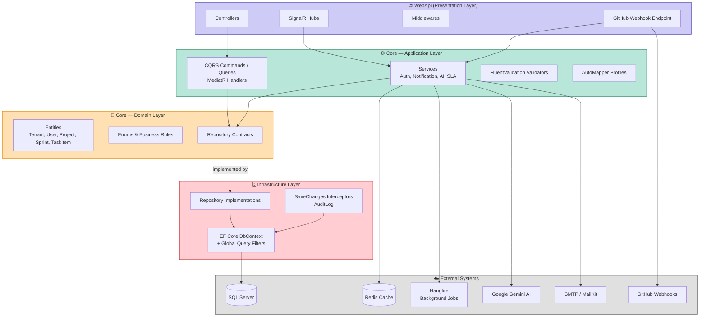
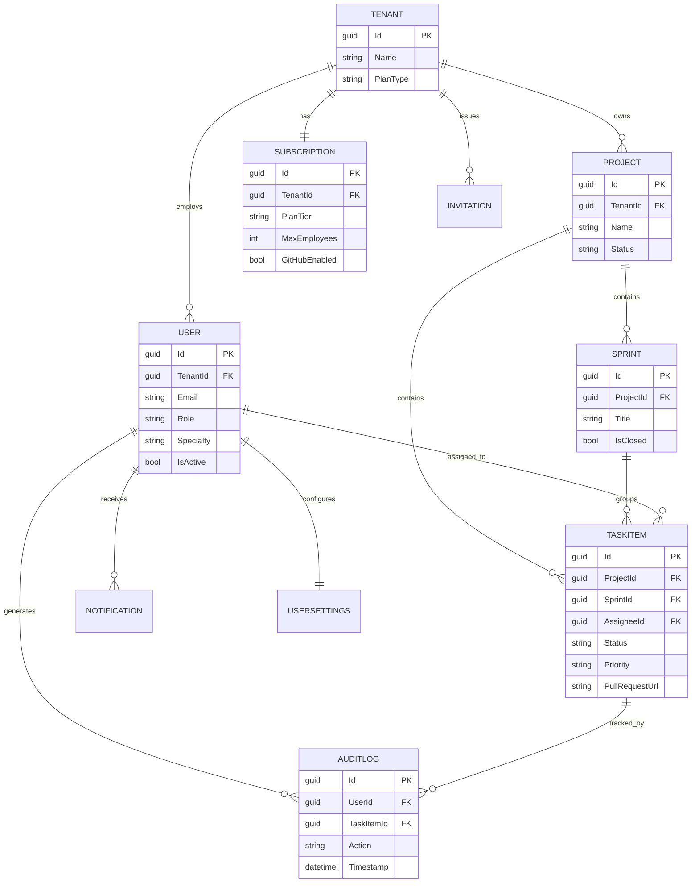
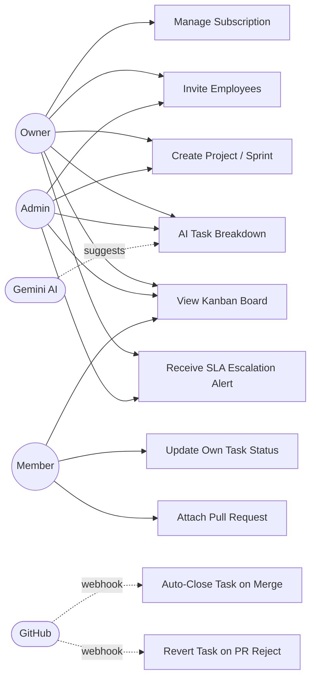

# 🚀 ProSync — Multi-Tenant SaaS Project Management Platform

**ProSync** is a production-grade, multi-tenant SaaS backend for team and project management — built from the ground up to demonstrate enterprise-level backend engineering: strict tenant data isolation, event-driven real-time updates, AI-assisted workflows, and full third-party integrations (GitHub Webhooks, Redis, Hangfire).

Unlike a typical CRUD portfolio project, ProSync was engineered around one central constraint from day one: **hundreds of companies share the same database and the same tables — and it must be provably impossible for one company to see another's data.**

> Built independently as a second portfolio project, following the graduation project *Hayy*, specifically to demonstrate advanced backend architecture, distributed systems patterns, and production-readiness practices.

---

## 📋 Table of Contents

- [Why This Project Exists](#-why-this-project-exists)
- [System Architecture](#-system-architecture)
- [Tech Stack](#-tech-stack)
- [Core Feature Modules](#-core-feature-modules)
- [Multi-Tenancy & Security Deep-Dive](#-multi-tenancy--security-deep-dive)
- [Entity-Relationship Diagram](#-entity-relationship-diagram)
- [Use Case Diagram](#-use-case-diagram)
- [Testing Strategy](#-testing-strategy)
- [Containerization](#-containerization)
- [API Overview](#-api-overview)
- [Getting Started](#-getting-started)
- [Project Structure](#-project-structure)
- [Roadmap / Known Gaps](#-roadmap--known-gaps)

---

## 🎯 Why This Project Exists

ProSync simulates a real Jira-style product: companies (**Tenants**) sign up, invite employees, create projects, break them into sprints, and manage tasks on a live Kanban board — with GitHub integration closing the loop between code and project management.

The engineering focus was **not** "build another to-do app." It was:

- How do you guarantee data isolation in a shared-database multi-tenant system — not just in application code, but enforced at the ORM query level?
- How do you keep a Kanban board updated in real time across a whole team without polling?
- How do you safely trust an external system (GitHub) sending you webhooks over the public internet?
- How do you use AI to *assist* a manager's decisions without letting it *silently make* those decisions unsupervised?
- How do you prove the whole system actually works — not with mocks, but against a real database spun up in Docker?

Every module below exists to answer one of these questions concretely.

---

## 🏗️ System Architecture

ProSync follows **Clean Architecture** with a **CQRS** pattern (via MediatR), enforcing strict separation of concerns and a one-way dependency rule: outer layers depend on inner layers — never the reverse.



**Dependency rule enforced:** `Domain` has zero external dependencies. `Application` depends only on `Domain`. `Infrastructure` and `WebApi` depend inward — never the other way around. This keeps business logic fully testable in isolation from EF Core, SignalR, or any framework concern.

---

## 🛠️ Tech Stack

| Category | Technologies |
|---|---|
| **Framework** | .NET 10, ASP.NET Core Web API |
| **Architecture** | Clean Architecture, CQRS (MediatR), Repository Pattern (Generic + Specific) |
| **Database** | SQL Server, Entity Framework Core |
| **Caching** | Redis (Cache-Aside Pattern, `IDistributedCache`) |
| **Real-Time** | SignalR (Group-based broadcasting) |
| **Background Jobs** | Hangfire (Fire-and-forget + Recurring Jobs) |
| **Authentication** | Custom JWT, Refresh Token Rotation, Google OAuth2, OTP (Email) |
| **Validation** | FluentValidation |
| **Mapping** | AutoMapper |
| **AI Integration** | Google Gemini API (task breakdown & smart assignment) |
| **External Integration** | GitHub Webhooks (HMAC-SHA256 verified) |
| **Email** | MailKit / SMTP |
| **Testing** | xUnit, Moq, FluentAssertions, **Testcontainers** (real SQL Server in Docker) |
| **Containerization** | Docker, Docker Compose, Multi-stage Dockerfile |
| **API Docs** | Swagger / OpenAPI with JWT Bearer auth support |

---

## 🧩 Core Feature Modules

### 1. Authentication & Multi-Tenant Identity
Custom-built (not ASP.NET Identity) to support strict multi-tenancy requirements that off-the-shelf identity systems don't handle out of the box.

- Registration → OTP email verification → Login flow
- **Access Token (15 min) + Refresh Token (7 days) with rotation** — old refresh tokens are revoked on every use, limiting the blast radius of a leaked token
- Google OAuth2 social login
- BCrypt password hashing (work factor 12) with automatic per-hash salting
- User Enumeration Prevention on `forgot-password` / `resend-otp` (always returns a generic success response, whether the email exists or not)
- Algorithm-confusion attack protection on JWT validation (explicit signing algorithm check)

### 2. Team & Invitation Management
- Owner/Admin invite employees by email with a pre-assigned Role and Specialty
- Invitation tokens hashed with SHA-256 (deterministic — needed for direct DB lookup, unlike BCrypt which is intentionally non-deterministic)
- Employee-count enforcement against subscription plan limits (`MaxEmployees`) before any invitation is sent
- Admin controls: deactivate/reactivate accounts, change roles — protected against self-lockout and against ever modifying the Owner account

### 3. Project → Sprint → Task (CQRS Core)
Full CQRS implementation via MediatR — every write is a `Command`, every read is a `Query`, each with its own dedicated handler and validator.

- **Projects:** Create / Update / Archive (soft-delete) / List
- **Sprints:** Create, and **Close** (computes and returns real completion statistics from associated tasks)
- **Tasks:** Create, update status, attach Pull Request, reassign
- **Enforced business rule:** a task belonging to a *closed* sprint cannot have its status changed — validated at the handler level, covered by unit tests
- **Enforced authorization rule:** a task can only be updated by its assignee, or by an Owner/Admin — verified per-request, not just via role attribute

### 4. Real-Time Kanban Board (SignalR)
- Clients join a `project-{id}` SignalR group when viewing a project board
- Any task status change is broadcast instantly to every connected team member in that group — no polling, no manual refresh
- Escalation alerts and PR-merge events are pushed through the same channel

### 5. Notifications (In-App + Email)
- Every meaningful event (task assigned, status changed, PR merged/rejected, SLA breach) creates a persistent `Notification` record **and** optionally triggers an email — governed per-user by `UserSettings` (`NotificationsEnabled`, `EmailNotifications`)
- Email delivery is dispatched as a **Hangfire background job**, not sent inline — so a `Register` or `ResendOtp` request returns immediately instead of blocking on an SMTP round-trip

### 6. Redis Caching (Cache-Aside Pattern)
- Subscription/plan data is cached per tenant (`subscription:{tenantId}`) with a 1-hour TTL
- **Active cache invalidation:** the moment a tenant upgrades/downgrades their plan, the stale cache entry is explicitly removed — the system doesn't wait for TTL expiry to reflect a plan change
- Verified with a dedicated unit test asserting `InvalidateCacheAsync` is called on every plan update

### 7. Feature Flags Guard (`[EnforceFeature]`)
- Custom `IAsyncActionFilter` (via `TypeFilterAttribute`, since standard attributes can't receive DI) that checks a tenant's subscription against a named feature (e.g. `GitHubIntegration`) *before* the controller action executes
- Reads from the Redis-cached subscription — meaning feature-gating adds near-zero latency per request

### 8. SLA Escalation Engine (Hangfire Recurring Job)
- A recurring background job (`0 */2 * * *`) scans for `Critical`-priority tasks that haven't been touched (`LastActivityAt`) in over 48 hours
- Automatically escalates: notifies all Owners/Admins of the tenant and pushes a live SignalR alert
- **Deliberately bypasses the tenant Query Filter** (`IgnoreQueryFilters()`) — since a background job has no HTTP request context, and by design needs to scan *across all tenants*, not just one

### 9. GitHub Webhook Integration
- Dedicated endpoint verifies every incoming payload against a `X-Hub-Signature-256` HMAC-SHA256 signature using a constant-time comparison (`CryptographicOperations.FixedTimeEquals`) — mitigating timing-attack signature forgery
- **Pull Request merged** → linked task auto-transitions to `Done`, assignee notified
- **Pull Request closed without merge** → task reverts to `ToDo`, PR link cleared, assignee notified with a "needs revision" message
- **Review comments requesting changes** → assignee notified with the reviewer's actual comment text, task stays in `Review`
- Task-to-PR linking is resolved by exact URL match — with a matching database query index

### 10. AI-Assisted Task Breakdown (Google Gemini)
- A manager submits a plain-language feature description + a list of team member IDs
- The backend resolves those IDs into real names and specialties (**the AI never receives raw IDs — only human-readable, tenant-verified names**, preventing prompt injection via unverified data)
- Gemini returns a structured JSON breakdown: task titles, descriptions, priorities, and a suggested assignee per task
- **Human-in-the-loop design:** implemented as a `/preview` (AI suggestion only, nothing persisted) → `/confirm` (manager reviews/edits, then commits) two-step flow — the AI proposes, a human disposes
- Every AI-suggested assignee name is validated against the actual tenant's team list before being trusted — the AI's raw output is never inserted directly into the database

### 11. Automatic Audit Trail
- An EF Core `SaveChangesInterceptor` transparently logs every `Create` / `Update` / `Delete` on every tenant-scoped entity — no manual logging code required in any handler
- Captures `WHO` (from JWT claims via `AsyncLocal` context), `WHAT` changed, and `WHEN` — nullable `UserId` correctly handles system-initiated events (e.g. account registration, before a user session exists)

---

## 🔐 Multi-Tenancy & Security Deep-Dive

This is the architectural core of the entire system.

### The Problem
Company A and Company B share the exact same `Projects`, `Tasks`, and `Users` tables. A single missed `WHERE TenantId = ...` clause anywhere in the codebase is a data breach.

### The Solution: Defense in Depth

1. **Database-level Global Query Filter** — every `TenantEntity` automatically applies `WHERE TenantId = @CurrentTenantId` via EF Core's `HasQueryFilter`, applied dynamically in `OnModelCreating` via reflection — so it's impossible to forget for a new entity.
2. **AsyncLocal-based Tenant Context** — `TenantId` is resolved once per HTTP request from JWT claims via middleware, and flows safely through async call chains without race conditions between concurrent requests.
3. **Mass-Assignment Protection** — every CQRS Command carries a `[JsonIgnore]` on its `TenantId` property. The tenant is *never* trusted from client input — only ever injected server-side from the authenticated user's JWT. (This was a real vulnerability found and fixed during development — see commit history.)
4. **Explicit Cross-Tenant Checks** — beyond the query filter, sensitive operations (assigning a task to a user, admin managing another user) run an explicit `if (target.TenantId != currentTenantId) throw` check — defense in depth, not reliance on a single layer.
5. **Proven, not assumed** — a dedicated **Testcontainers integration test** spins up a real, empty SQL Server instance, seeds two tenants with users, and asserts that querying as Tenant A returns *zero* rows belonging to Tenant B. This runs against actual EF Core-generated SQL — not a mock.

---

## 🗂️ Entity-Relationship Diagram



---

## 👤 Use Case Diagram



---

## ✅ Testing Strategy

Testing is split deliberately into two tiers with different goals:

| Type | Tool | What It Proves |
|---|---|---|
| **Unit Tests** | xUnit + Moq + FluentAssertions | Business logic correctness in isolation — every dependency mocked. Covers Auth, Invitations, Admin, Task business rules, GitHub webhook event handling, and Redis caching logic (cache-hit vs. cache-miss vs. invalidation). |
| **Integration Tests** | Testcontainers.MsSql | The system works against a **real** database — real Migrations applied, real SQL generated, real Query Filters enforced. Currently proves Multi-Tenancy isolation end-to-end. |

**60+ tests** covering: registration/login edge cases, OTP flows, refresh token rotation, admin authorization boundaries, sprint-closed business rule enforcement, task reassignment tenant checks, GitHub merge/reject/review-comment paths, and Redis cache-aside behavior.

---

## 🐳 Containerization

- Multi-stage `Dockerfile` (SDK build stage → slim ASP.NET runtime stage) targeting Linux containers
- Configuration is fully externalized via environment variables (`Jwt__Secret`, `ConnectionStrings__DefaultConnection`, etc.) — no secrets baked into the image, matching real cloud deployment practice (Azure App Service / Kubernetes)
- Verified with a standalone `docker build` + `docker run`, confirming the API serves traffic with zero dependency on the host machine's local configuration

---

## 📡 API Overview

| Area | Endpoints |
|---|---|
| **Auth** | Register, Verify OTP, Login, Refresh Token, Logout, Forgot/Reset Password, Change Password, Google Login, Get Me, Delete Account |
| **Invitations** | Invite User, Accept Invitation |
| **Admin** | List Users, Deactivate/Activate, Change Role |
| **Subscription** | Get, Upgrade Plan |
| **Projects** | Create, Update, Archive, Get, List |
| **Sprints** | Create, Close (with stats) |
| **Tasks** | Create, Update Status, Attach PR, Reassign, AI Breakdown (Preview/Confirm) |
| **Notifications** | Get Unread, Mark as Read |
| **User Settings** | Get/Update, Update Specialty |
| **Webhooks** | GitHub (Pull Request + Review events) |
| **Health** | `/health` |

Full interactive documentation available via Swagger UI (`/swagger`) with built-in JWT Bearer authorization support.

---

## 🚀 Getting Started

### Prerequisites
- .NET 10 SDK
- SQL Server (local or containerized)
- Docker Desktop (for Redis + Testcontainers)
- A Gemini API key ([aistudio.google.com](https://aistudio.google.com))

### Setup

```bash
# 1. Clone the repository
git clone https://github.com/AhmedSVHamdy/ProSync.git
cd ProSync

# 2. Start Redis
docker run -d -p 6379:6379 --name prosync-redis redis

# 3. Configure secrets (from the WebApi project directory)
dotnet user-secrets set "ConnectionStrings:DefaultConnection" "your-connection-string"
dotnet user-secrets set "Jwt:Secret" "your-long-random-secret"
dotnet user-secrets set "Gemini:ApiKey" "your-gemini-api-key"
dotnet user-secrets set "GitHub:WebhookSecret" "your-webhook-secret"
dotnet user-secrets set "EmailSettings:SenderEmail" "your-email"
dotnet user-secrets set "EmailSettings:SenderPassword" "your-app-password"

# 4. Apply database migrations
dotnet ef database update --project Infrastructure --startup-project WebApi

# 5. Run
dotnet run --project WebApi
```

Swagger UI will be available at `https://localhost:{port}/swagger`.

---

## 📁 Project Structure

```
ProSync/
├── Core/                          # Domain + Application layers
│   ├── Domain/
│   │   ├── Entities/               # Tenant, User, Project, Sprint, TaskItem...
│   │   ├── Enums/
│   │   └── RepositoryContracts/
│   ├── Application/
│   │   ├── Features/                # CQRS Commands & Queries per module
│   │   ├── DTOs/
│   │   ├── Mapping/                 # AutoMapper profiles
│   │   └── Validators/              # FluentValidation
│   ├── ServiceContracts/
│   ├── Services/
│   └── Common/MultiTenancy/         # TenantProviderAccessor
├── Infrastructure/
│   ├── Data/                        # ProSyncContext
│   ├── Configurations/              # EF Core entity configs
│   ├── Repositories/
│   └── Interceptors/                # AuditLogInterceptor
├── WebApi/
│   ├── Controllers/
│   ├── Hubs/                        # SignalR KanbanHub
│   ├── Middlewares/
│   ├── Filters/                     # EnforceFeatureAttribute
│   ├── Services/                    # SignalRTaskNotifier, HangfireBackgroundJobService
│   └── Dockerfile
└── Tests/
    ├── Services/                    # Unit tests
    ├── Handlers/                    # CQRS handler tests
    └── Integration/                 # Testcontainers-based tests
```

---

## 🗺️ Roadmap / Known Gaps

Documented transparently — a working list, not a finished claim:

- [ ] Unit test coverage for Sprint close statistics and additional GitHub webhook edge cases
- [ ] Rate limiting per tenant (planned, not yet implemented)
- [ ] Docker Compose bundling the full stack (API + SQL Server + Redis) for one-command local spin-up
- [ ] Real payment gateway integration for subscription billing (currently plan changes are admin-triggered, not payment-gated)

---

## 👨‍💻 Author

**Ahmed Mohamed Taha** — Backend .NET Developer
[GitHub](https://github.com/AhmedSVHamdy) · [LinkedIn](https://linkedin.com/in/ahmed-mohamed-taha)
